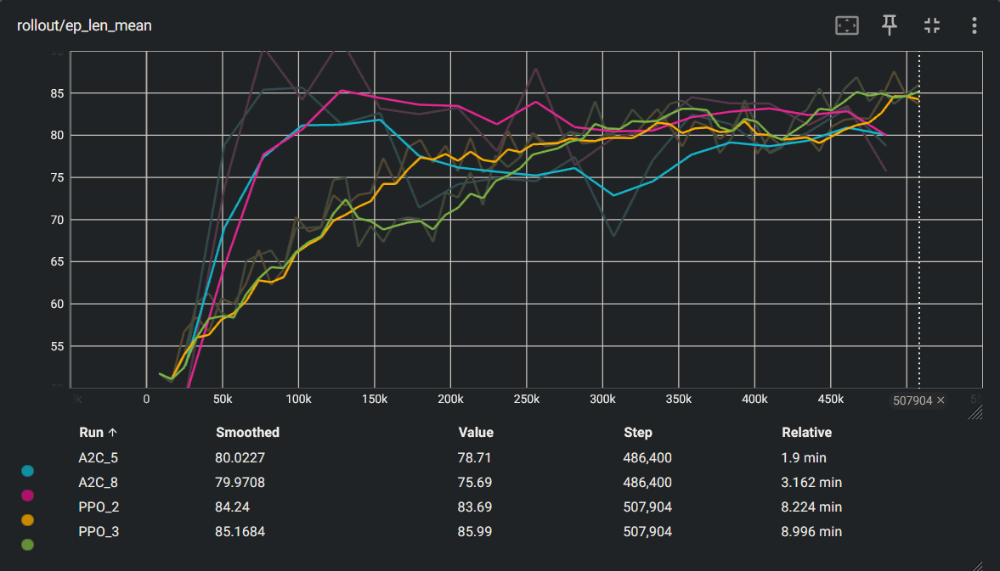

# *Assignment 1 – Deep Reinforcement Learning for Automated Testing*

This project implements a **Deep Reinforcement Learning (DRL) testing framework** that automates gameplay and interaction testing across two environments:
-  **Tetris** (2D game)
-  **Web Navigation App** (multipage flow)

The goal is to **detect risky behaviors and regressions automatically** using trained DRL agents (not scripted bots).  
Agents learn different *testing personas* by optimizing distinct reward functions.

---

##  Objectives
**Goal 1 — Issue Detection via Rewards:**  
Design reward functions that highlight specific faults or risky behaviors (e.g., crashes, timeouts, stuck states).

**Goal 2 — Automated Metrics:**  
Collect in-game and app-level metrics automatically per episode and aggregate them into CSV/JSON files for analysis.

---

## ️ Project Architecture
````
tetris/
│
├─ envs/ # Custom Gymnasium environments
│ ├─ tetris_env.py # Tetris game environment + reward shaping
│ └─ web_env.py # Web flow automation (Selenium/Playwright)
│
├─ src/ # Core framework
│ ├─ train.py # Training script (PPO, A2C)
│ ├─ eval.py # Evaluation script (metrics, model replay)
│ ├─ utils.py # Helpers (env builder, seed fixing, wrappers)
│ └─ metrics.py # Logger exporting CSV + JSON
│
├─ models/ # Saved trained models (.zip)
├─ logs/ # TensorBoard + evaluation metrics
├─ configs/ # Optional YAML/Hydra configs
├─ notebooks/ # Analysis notebooks and visualizations
└─ README.md
````

The codebase is fully **decoupled** between environment definitions, training logic, and evaluation/metric reporting, making it reusable for future apps.

---

##  Setup

### Requirements
- Python 3.12+
- PyTorch 2.5.1+cu121
- Stable-Baselines3 ≥2.3.0
- Gymnasium ≥0.29
- Pygame, Numpy, TensorBoard, Matplotlib

### Installation
```bash
git clone https://github.com/<your-username>/drl-automated-testing.git
cd drl-automated-testing
python -m venv .venv
.\.venv\Scripts\activate  # (Windows)
pip install -r requirements.txt
```
##  Training
### Example: PPO on Tetris
````
python -m src.train --algo ppo --app tetris --persona survivor \
  --steps 500000 --device cuda --frame_stack 4 --seed 7 \
  --save models/ppo_tetris_survivor
````

### Example: A2C on Tetris
````
python -m src.train --algo a2c --app tetris --persona explorer \
  --steps 500000 --device cuda --frame_stack 4 \
  --a2c_n_steps 32 --save models/a2c_tetris_explorer
````

### Example: Web App (CPU preferred)
````
python -m src.train --algo ppo --app web --persona survivor --steps 200000 --device cpu
````

##  Evaluation
Run trained agents and collect metrics (CSV + JSON):
````
python -m src.eval --algo ppo --app tetris --persona survivor \
  --model models/ppo_tetris_survivor.zip --episodes 30 --device cuda --frame_stack 4
````
All results are stored under:
````
logs/
 ├─ tb_tetris/                # TensorBoard training logs
 ├─ eval/
 │   ├─ tetris-ppo-survivor-7.json
 │   └─ tetris-ppo-survivor-7.csv
 └─ screenshots/              # optional gameplay captures
````
##  Personas (Reward Designs)
| Persona  |                Description                |                  Reward Signal                  |
|:--------:|:-----------------------------------------:|:-----------------------------------------------:|
| Survivor |    Prioritizes longevity and stability    |       +1 per step survived, −10 per death       |
| Explorer | Encourages risk-taking and state coverage | +5 per new area visited, −5 per repeated states |

These reward functions yield contrasting behaviors, helping simulate different QA testing personas.

##  Metrics Collected
Automatically logged at both episode and aggregate levels:
- **Game**: Lines cleared, episode length, reward, survival time.
- Stored as `.csv` and `.json`.

[//]: # (- **Web**: Unique pages reached, clicks per session, validation errors.)

#### Tensorboard chart

#### Legend
- <i style="color:#27BBF5;">A2C_5 - A2C Algorithm on Survivor Persona</i>
- <i style="color:#BA007C;">A2C_8 - A2C Algorithm on Explorer Persona</i>
- <i style="color:#FFDD00;">PPO_2 - PPO Algorithm on Survivor Persona</i>
- <i style="color:#80FF73;">PPO_3 - PPO Algorithm on Explorer Persona</i>

##  Results Summary
### Learning Curves

|       Metric        |               PPO               |         A2C         | Observation                           |
|:-------------------:|:-------------------------------:|:-------------------:|---------------------------------------|
| Avg. Episode Length |              85-86              |         ~80         | PPO learns faster and survives longer |
|      Stability      |              High               |      Moderate       | PPO's clipping prevents divergence    |
|  Sample Efficiency  | Faster convergence(~100k steps) | Slower(~150k steps) |                                       |
|    Compute Time     |         Slightly higher         |        Lower        | PPo's minibatch updates costlier      |
|     Best Model      |             `PPO_3`             |       `A2C_5`       | PPO_3 achieves best consistency       |

### Interpretation:
PPO agents demonstrate smoother and more stable learning, achieving higher episode lengths and more consistent performance. A2C converges faster initially but plateaus at a lower reward ceiling.

## Reproducibility

- Fixed random seeds (--seed 7)
- Deterministic PyTorch + Gym setup
- All model artifacts saved to /models
- Dependencies pinned in requirements.txt
- Logs + metrics exportable for reproducibility

## Run Commands for each Persona and Algorithm

### Train PPO
````
python -m src.train --algo ppo --app tetris --persona survivor --steps 500000 --seed 7 --device cuda
````
### Train A2C
````
python -m src.train --algo a2c --app tetris --persona survivor --steps 500000 --frame-stack 4 --device cpu --seed 42 --save models/a2c_tetris_survivor
````

### Evaluate PPO
````
python -m src.eval  --algo ppo --app tetris --persona survivor --model models/ppo_tetris_survivor.zip --episodes 30 --device cuda
````
### Evaluate A2C
````
python -m src.eval --algo a2c --app tetris --persona survivor --model models/a2c_tetris_survivor.zip --episodes 30 --frame-stack 4 --device cpu
````

### Visualize PPO Gameplay
````
python visualize.py --model_path models/ppo_tetris_survivor --fps 60
````
### Visualize A2C Gameplay
````
python visualize.py --model_path models/a2c_tetris_survivor --fps 60
````

## Requirements

````
pip install -r requirements.txt
````

## License
MIT License © 2025 Ontario Tech University
For educational and research use only.